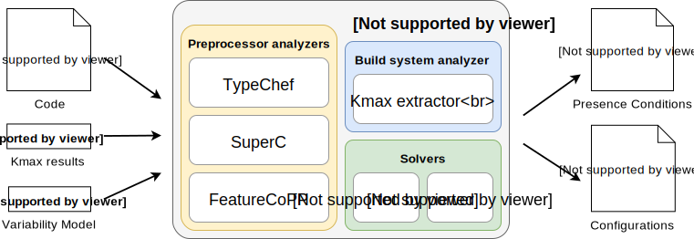

# PCLocator



PCLocator is a Java tool that analyzes presence conditions in variable software
systems written in the programming language C. (There are some slides [available
online](http://elias-kuiter.de/splc18-pclocator-slides).)

A presence condition describes under which circumstances a file or block of code
is included in the compiled product. A naive, but slow solution is enumerating
all possible configurations of the software.

There are better tools available to analyze variability in C. PCLocator
integrates the following tools:

- [TypeChef](https://github.com/ckaestne/TypeChef) and
  [xtc](https://github.com/paulgazz/xtc), variability-aware C parsers
- [FeatureCoPP](https://dl.acm.org/citation.cfm?id=3001876), a tool for physical
  separation of annotated features that includes a cpp parser
- [Kmax](https://github.com/paulgazz/kmax), a variability-aware analyzer
  Kconfig/Kbuild Makefiles

This tool addresses a [challenge
case](https://github.com/paulgazz/splc18challengecase) of the SPLC 2018
Challenge Track and is mentioned in our paper [PCLocator: A Tool Suite to
Automatically Identify Configurations for Code
Locations](http://elias-kuiter.de/splc18-pclocator).

## Getting started

The easiest way to set up PCLocator is to download a prepared JAR distribution
[here](https://github.com/ekuiter/PCLocator/releases).

To build from source, additionally to cloning the repository, you need to
download the libraries [here](https://github.com/ekuiter/PCLocator/releases)
(every JAR file but `PCLocator.jar`) and copy them to the `lib` folder. Generate
the output jar from IntelliJ using `Build > Build Artifacts...` and run
`scripts/post_build.sh`.

## Usage

PCLocator requires Java 1.8. Run it with:

```
java -jar PCLocator.jar <arguments>
```

If you don't provide any arguments, detailed usage information will be printed.

To use one of the shell scripts described below, run `chmod +x *.sh` to make
them executable.

## Virtual Machine

PCLocator comes with a virtual machine for reproducible results. (It does not
have to be used though.) To use it, install
[Vagrant](https://www.vagrantup.com/). The JAR distribution ships with a
`Vagrantfile`, so just run `vagrant up` while in the distribution folder. You
will be prompted to install the `hashicorp/precise64` box, a Ubuntu VM. As
provider, we used VirtualBox.

When the VM is running, use `vagrant ssh` to enter a shell. To set up PCLocator
and its dependencies (notably Java), run:

```
cd PCLocator
./setup.sh
```

After accepting the Java License Agreement, PCLocator can be used as described
in this README. (Maybe consider adjusting the RAM size `vb.memory` in
the `Vagrantfile`, then run `vagrant reload`.)

### Examples

#### Presence condition

Extract a single presence condition for the line `<line>` in a C file `<file>`
(using the default parser, a combination of the tools above):

```
java -jar PCLocator.jar <file>:<line>
```

Leave off the `<line>` to get a tabular overview of all presence conditions
using all parsers.

To account for platform-specific macro usage, it is suggested to generate a
platform header file with `echo - | gcc -dM - -E -std=gnu99` and pass it
with `--platform`.

#### Configuration space

Derive the satisfying configuration space from a feature model in the DIMACS
format (see [here](http://people.sc.fsu.edu/~jburkardt/data/cnf/cnf.html) and
[here](https://github.com/ckaestne/TypeChef/blob/master/FeatureExprLib/src/main/scala/de/fosd/typechef/featureexpr/FeatureModelFactory.scala)):

```
java -jar PCLocator.jar --configure <dimacs_file> <file>:<line>
```

Only features declared in the DIMACS file are considered when deriving
configurations to prevent compiler-specific macros being added to the
configuration. Some DIMACS files are included in the `scripts` directory.

#### Build system

To consider build system information in projects which use Kconfig/Kbuild, you
can use Kmax. PCLocator takes a Kmax `unit_pc` file (including presence
conditions for every directory and file in the project). Have a look at
[kmax-vm](https://github.com/ekuiter/kmax-vm) if you want to generate such a
file. Some files for Busybox and Linux are included in the `scripts` directory.

Run the analysis with

```
java -jar PCLocator.jar --locator kmax --kmaxfile <unit_pc_file> --projectroot <root_directory> <file>:<line>
```

`<root_directory>` should be the directory the entries in the `unit_pc` file
refer to, i.e. the root directory of the analyzed project.

#### Explanation

When analyzing individual lines, add `--explain` to the command line to get an
explanation for how the presence condition for the analyzed line has been
located.

### Analyses

#### Variability Bugs Database

To analyze the VBDB (Abal et. al ASE14), build PCLocator and `cd` into
`scripts/vbdb`.

Use `vbdb_annotate.sh` to produce a file containing presence
conditions and configurations for each file and quickly assess the results.

Use `vbdb.sh` to locate presence conditions and `vbdb_configure.sh` to derive
configurations. Just pass them the location and any additional arguments, e.g.:

```
./vbdb.sh --explain splc18challengecase/vbdb/linux/simple/8c82962.c:58
```

`vbdb_configure.sh` takes as first argument the feature model:

```
./vbdb_configure.sh linux.dimacs splc18challengecase/vbdb/linux/simple/8c82962.c:58
```

Use `vbdb_challenge.sh` to tackle the challenge. It takes as first argument the
program location to analyze (see `locations.txt` for reference), any following
arguments are propagated to PCLocator, e.g.

```
./vbdb_challenge.sh splc18challengecase/vbdb/marlin/simple/2d22902.c:11 --limit 1
```

It will enumerate configurations that include the given program locations and
generate some files in the `challenge` directory: the preprocessed C file, the
compilation result (if any) and a log file containing any errors (a log file for
each configuration and an additional log file containing all errors PCLocator
returned).

Note that by default, like with the `*_configure.sh` scripts, the *entire*
configuration space is enumerated. To sample, say, just one configuration, pass
``--limit 1`` like above. (Or ``--timelimit 1s`` to limit configuration space
deduction to one second. Note that the preprocessing/compilation steps may take
much longer.)

For convenience, `vbdb_challenge_peek.sh` enumerates every location given in the
challenge and analyzes only one configuration using `vbdb_challenge.sh`. It
takes no arguments.

Evaluation has been done using `vbdb_evaluate.sh`. This generates CSV files and
preprocessed C files with statistical information.

#### BusyBox

To analyze BusyBox, build PCLocator and `cd` into `scripts/busybox`. Use
`busybox.sh` to locate presence conditions and `busybox_configure.sh` to derive
configurations. Just pass them the location and any additional arguments, e.g.:

```
./busybox.sh --parser typechef busybox-1.18.5/modutils/modprobe.c:1
```

With `busybox_compile.sh` you can compile some configuration that includes the
given program location. It takes as first argument the program location to
analyze, any following arguments are propagated to PCLocator, e.g.

```
./busybox_compile.sh busybox-1.18.5/modutils/lsmod.c:50 --parser featurecopp
```

The final binary can be executed with `busybox-1.18.5/busybox`. We have only
tried random samples, so compilation might fail due to libraries missing. This
can be resolved by installing the missing libraries.

Evaluation has been done using `busybox_evaluate.sh` and `busybox_sample.sh`.
Like with VBDB, this generates statistical information. Some evaluation results
can be found in the `evaluation` directory.

The Kmax files have been generated using
[kmax-vm](https://github.com/ekuiter/kmax-vm). The DIMACS file from the
[TypeChef BusyBox
analysis](https://github.com/ckaestne/TypeChef-BusyboxAnalysis/blob/master/busybox/featureModel.dimacs)
is used.

Note that we analyze BusyBox 1.18.5 here because a feature model was freely
available. For newer versions, check out
[KBuildMiner](https://github.com/ckaestne/KBuildMiner/) to transform KConfig
files to a feature model.

## Manual library setup

Setting up the `lib` folder can be a little involved, because the integrated
tools depend on different versions of the same library.

Here are instructions to reproduce the libraries provided above, if needed:

- Build TypeChef according to its instructions (`sbt assembly`).
- Edit the JAR (e.g., by extracting and re-zipping it) and remove the `xtc` folder.
  This is necessary because the xtc version included by TypeChef is outdated.
- Copy the resulting JAR to `lib/TypeChef.jar`.
- Download xtc (which includes SuperC) and copy the included JAR files
  (`ccl.jar`, `javabdd.jar`, `javacc.jar`, `javancss.jar`, `JFlex.jar`,
  `jhbasic.jar`, `junit.jar`, `rats-runtime.jar`, `rats.jar`, `xtc.jar`) to `lib`.
- From `FeatureCoPP.jar`, extract `choco-solver-4.0.4-with-dependencies.jar` and
  `JCParser.jar` and copy them to `lib`.
